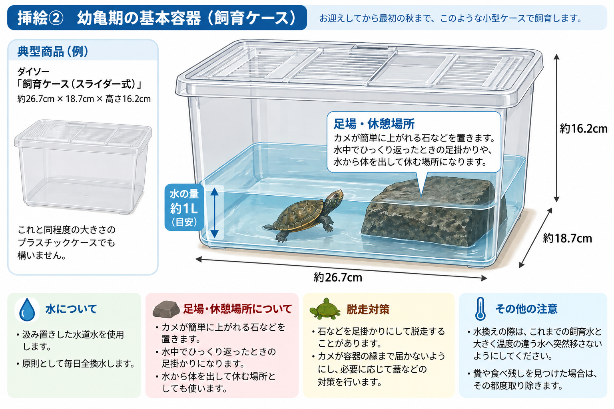
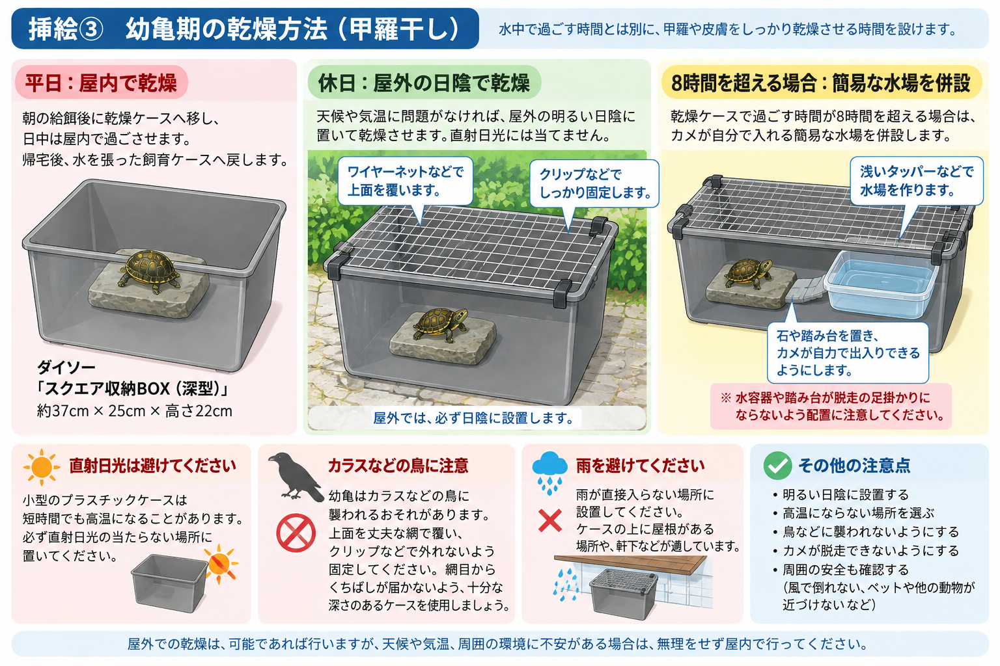
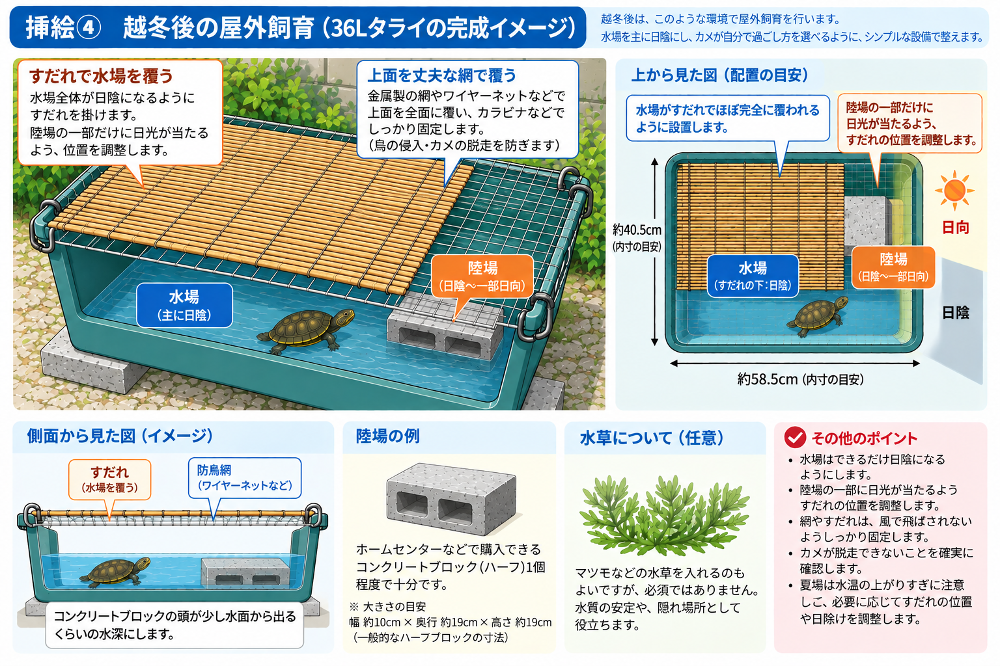

# ニホンイシガメ 幼亀・若亀 飼育マニュアル

このマニュアルでは、**甲長約3.5cmの幼亀をお迎えしてから約2年間**の基本的な飼育方法を説明します。

ニホンイシガメは成長すると、より大きな飼育環境が必要になります。このマニュアルでは、幼亀のうちは小さな容器でこまめに管理し、成長に合わせて少しずつ通常の飼育方法へ移行していきます。

**2年目の秋には、そのまま飼育を続けるか、譲渡者へ返却するかを選択できます。**

---

# 飼育を検討されている方へ

ニホンイシガメの飼育は、**子どもが中心になって取り組むことも大歓迎です。**  
餌やりや毎日の観察など、ぜひ一緒に楽しんでください。

ただし、成長に合わせた飼育設備の変更、タライの設置、屋外での鳥・脱走対策、越冬の準備など、**子どもだけで行うことが難しい作業もあります。**

お子さんが飼育する場合も、すべてを子ども任せにはせず、**保護者の方も一緒に飼育に関わってください。**

最初から大掛かりな飼育設備をすべて用意する必要はありません。

最初は小型ケースなどを使って飼育し、**初めての越冬を終えた後に中型のタライへ移行**します。

## 飼育前にご確認ください

- 幼亀の間は、小型ケースで飼育し、原則毎日水を換えます
- 幼亀の間は、普段の水中飼育とは別に甲羅や皮膚を乾燥させる時間を設けます
- 平日は屋内、休日は可能であれば屋外の日陰で乾燥させます
- 屋外へ出す場合は、鳥などに襲われないための簡単な対策が必要です
- 冬は屋外で越冬させることを基本とします
- 越冬後は、底面がおおむね60cm×40cm程度のタライを屋外に設置します
- 屋外のタライには、鳥・脱走対策と日陰を用意します
- 2年目の秋に、飼育を続けるか譲渡者へ返却するかを選べます

## 最初に必要になる主なもの

- 幼亀用の飼育ケース
- 乾燥用ケース
- 足場・休憩場所に使う石など
- カメ用の餌
- 屋外へ出す場合の防鳥用の網など

> **越冬後に使用する大型のタライなどを、最初から購入する必要はありません。**

---

# 1. 2年間の飼育ロードマップ

スマートフォンでも確認しやすいよう、飼育環境の変化を時系列で示します。

### 🐢 お迎え～最初の秋｜幼亀期

**甲長の目安：約3.5～5cm**

- 小型ケース・浅水で飼育
- 別ケースで甲羅・皮膚を乾燥
- 餌：レプトミン小粒の給餌方法を基本
- 換水：毎日

↓

### ❄️ 1年目の冬｜初めての越冬

**甲長の目安：約4～6cm**

- 屋外で水中越冬
- 気温・活動量の低下に合わせて給餌を減らす
- 冬眠中は給餌しない
- 換水は越冬環境に合わせる

↓

### 🌱 越冬明け～｜移行期

**甲長の目安：約5～7cm～**

- 中型タライへ移行
- 屋外で水場・陸場を常設
- 成長に合わせて餌を中粒等へ移行
- 換水頻度を毎日から徐々に減らす

↓

### ☀️ 1～2歳｜若亀期

**甲長の目安：約6～10cm程度**

- 同じ中型タライで屋外飼育
- 成長に合わせて中粒・大粒等へ移行
- 換水は週2～3回程度を目安に調整

↓

### 🏠 2年目の秋｜今後の飼育を選択

- **そのまま飼育を続ける**
- **譲渡者へ返却する**

のいずれかを選択できます。

> ※成長速度には個体差があります。時期や甲長はあくまで目安です。

---

# 2. 幼亀期の飼育

## 2-1. 飼育容器

お迎え直後は、小型のプラスチック製飼育ケースを使用します。

### 典型商品

**ダイソー「飼育ケース（スライダー式）」**  
約26.7cm × 18.7cm × 高さ16.2cm

これと同程度の大きさのプラスチックケースでも構いません。

容器に**約1Lの汲み置きした水**を張ります。

カメが簡単に上がれる石などを置きます。この石は、休憩場所になるほか、水中でひっくり返ったときに起き上がるための足掛かりにもなります。

石を足掛かりにして脱走することもあるため、カメが容器の縁まで届かないようにしてください。必要に応じて蓋などの脱走対策も行います。

---

## 2-2. 餌

主食には、カメ用の総合栄養食を使用します。

**使用例：テトラ レプトミン 小粒**

成長したら、中粒・大粒などへ移行します。

粒の大きさや給餌頻度については、**使用する製品に記載された給餌方法を基本**としてください。

### どれくらい与える？

決まった粒数ではなく、**食欲が明らかに鈍ってくるまで**を一回量の目安にします。

食べ始めは勢いよく餌を追いますが、満腹に近づくと、

- 餌を追う勢いが弱くなる
- 次の餌を食べるまでの間隔が長くなる
- 口に入れてから飲み込むまで時間がかかる

などの変化が見られます。

このあたりを給餌終了の目安にしてください。

食べ残した餌は水を汚すため、取り除きます。

---

## 2-3. 水換え

幼亀期の小型容器では、**原則として毎日全換水**します。

飼育には、**あらかじめ汲み置きしておいた水道水の使用を推奨**します。

水換え用の水を別の容器などに準備しておき、次の水換えまで置いておくと便利です。

糞や食べ残しを見つけた場合は、その都度取り除きます。

水換えの際は、それまでの飼育水と大きく温度の違う水へ突然移さないようにしてください。

---

# 3. 幼亀期の甲羅干し・乾燥

幼亀期は、水中で過ごす時間とは別に、**甲羅や皮膚をしっかり乾燥させる時間**を設けます。

乾燥用には、普段の飼育容器とは別のケースを使用します。

## 3-1. 乾燥用ケース

### 典型商品

**ダイソー「スクエア収納BOX」深型**  
約37cm × 25cm × 高さ22cm

これと同程度の大きさ・深さのあるプラスチックケースでも構いません。

ケースには、カメが乗って体を乾かせる石などを置きます。

深さのあるケースを使用することで脱走を防ぎやすくするとともに、屋外使用時にカラスなどの嘴が幼亀まで届きにくくします。

---

## 3-2. 平日

朝の給餌後に乾燥ケースへ移し、**屋内で日中を過ごさせます。**

帰宅後、水を張った通常の飼育ケースへ戻します。

---

## 3-3. 休日

天候や気温に問題がなければ、乾燥ケースを**屋外の明るい日陰**に置きます。

屋外であっても、乾燥ケースを直射日光には当てません。

### ⚠️ 屋外では鳥に注意

幼亀は、**カラスなどの鳥に襲われるおそれがあります。**

短時間でも、屋外に無防備な状態で置かないでください。

乾燥ケースは十分な深さのあるものを使用したうえで、**上面を丈夫な網やワイヤーネットなどで覆い、クリップ等で外れないよう固定**してください。

「網があるから大丈夫」と考えず、カラスの嘴が幼亀まで届かないことも確認してください。

---

## 3-4. 長時間になる場合

乾燥ケースで過ごす時間が**8時間を超える場合は、カメが自分で入れる簡易な水場の併設を推奨**します。

浅いタッパーなどに水を入れ、段差がある場合は石や踏み台を設置して、カメが自力で安全に出入りできるようにします。

踏み台や水容器が脱走の足掛かりにならないことも確認してください。

---

## 3-5. 屋外での注意

> **⚠️ 小さな乾燥ケースを直射日光に当てないでください。**

小型のプラスチックケースは短時間でも高温になることがあります。

屋外に出す場合は、

- 直射日光が当たらない
- 高温にならない
- 雨が直接入らない
- 鳥などに襲われない
- カメが脱走できない

ことを確認してください。

---

# 4. 初めての越冬

ニホンイシガメは、気温が下がると活動量や食欲が低下し、冬は水中などで冬眠します。

このマニュアルでは、**屋外で自然な気温の変化に合わせて越冬させる**ことを基本とします。

## 4-1. 越冬環境

鳥などに襲われたり、カメが脱走したりしないよう対策でき、必要な水量を確保できる容器を使用します。

越冬中は、

- カメが水中で越冬できるだけの水を確保する
- 容器の水がすべて凍結するような場所は避ける
- 水が減ってカメの体が露出したり、容器が干上がったりしないよう確認する
- 鳥やその他の動物に襲われないよう、網などで保護する
- 冬眠中はむやみにカメを起こしたり、頻繁に触ったりしない

ことに注意します。

秋になって食欲や活動量が低下してきたら、カメの様子を見ながら給餌を減らしていきます。食べなくなった後は、無理に餌を与えません。

春になり、気温が上がってカメが自発的に活動するようになったら、状態を確認しながら通常の飼育へ戻していきます。

---

## 4-2. 越冬用の容器について

春以降に使用する36Lタライを、越冬前に用意することは**必須ではありません。**

条件を満たす手持ちの容器などがあれば、越冬にはそれを利用できます。

一方、春以降も使用できるため、先に36Lタライを用意して越冬に使用しても構いません。

> 初めての越冬には一定のリスクがあります。**越冬前に、その後の飼育に必要となる設備をすべて購入する必要はありません。**

---

# 5. 越冬後の屋外飼育

初めての越冬を終え、春になって活動と摂餌が安定したら、幼亀用の小型ケースから中型タライへ移行します。

ここからは、**水場と陸場を常設した屋外飼育**を基本とします。

## 5-1. タライの大きさ

底面がおおむね**60cm×40cm程度**あるものを目安とします。

### 典型商品

**カインズ「ホースが留められるタライ 36L」**  
約58.5cm × 40.5cm × 高さ29.5cm

これと同程度の底面積があり、水を張って使用できる丈夫な容器であれば、別の商品でも構いません。

原則として、この容器を**2年目の秋まで使用**することを想定しています。

ただし、成長が非常に早く明らかに手狭になった場合は、途中でもより大きな容器へ変更してください。

---

## 5-2. タライの設置

タライには、

- 水場
- 陸場
- 日向
- 日陰
- 脱走・鳥害防止設備

を用意します。

タライの上面全体を丈夫な金属製の網やワイヤーネットなどで覆い、**カラビナ等でしっかり固定**します。

その上からすだれを掛け、**水場はできるだけ日陰になるようにします。**

一方、陸場については一部に日光が当たるように、すだれの位置を調整します。

上面を何割覆っているかだけではなく、太陽の向きや時間帯によって、**実際に水場が日陰になっていること**を確認してください。

### 陸場

陸場は複雑なものを作る必要はありません。

ホームセンターなどで購入できる**一般的なハーフサイズのコンクリートブロック1個程度**でも構いません。

ブロックは寝かせて設置し、**ブロックの頭が水面から少し出る程度の浅い水深**にします。

### 水草

水草は必須ではありません。

マツモなどの水草を入れると、水質の安定やカメの隠れ場所として役立つことがあります。管理できる範囲で使用してください。

この環境へ移行した後は、幼亀期に行っていた**別ケースでの強制的な乾燥は徐々に終了**します。

---

# 6. 成長に伴う世話の変化

越冬後は、一度にすべてを成体と同じ管理へ変更する必要はありません。

カメの成長や状態を確認しながら、徐々に通常の飼育方法へ移行します。

## 6-1. 餌

成長に合わせて、

**レプトミン小粒 → 中粒 → 大粒**

など、食べやすい大きさの餌へ移行します。

粒の大きさや給餌頻度は、**使用する製品に記載された給餌方法を基本**とします。

一回量については、幼亀期と同様に、食べる勢いが明らかに鈍ってきたことを終了の目安にできます。

---

## 6-2. 換水

幼亀期の小型容器では毎日換水しますが、カメが成長し、飼育容器と水量も大きくなったら、状態を確認しながら徐々に換水間隔を延ばします。

目安として、

**毎日 → 隔日 → 週3回程度 → 週2回程度**

と段階的に移行します。

水の濁りや臭い、皮膚や甲羅の状態などに問題がないことを確認しながら調整してください。

糞や食べ残しは、換水日でなくても見つけたら取り除きます。

若亀期以降は、**週2回程度**を最終的な目安とします。

ただし、梅雨明けからお盆明け頃までの暑い時期は水が傷みやすいため、**隔日程度**を目安に換水頻度を増やします。

---

# 7. 2年経過後

2年目の秋になったら、

1. **そのまま飼育を続ける**
2. **譲渡者へ返却する**

のいずれかを選択できます。

## 飼育を続ける場合

ニホンイシガメは、その後も成長します。

成長に合わせて、より大型のタライなど、水場と陸場を十分に確保できる**終生飼育に適した環境**へ移行してください。

## 返却する場合

返却を希望する場合は、所定の方法で譲渡者へ連絡してください。

---

# FAQ

## Q1. 旅行などで1～2日家を空けても大丈夫？

健康で普段から餌をよく食べている個体であれば、**1～2日程度は餌を与えなくても構いません。**

出発前に多めの餌を与えたり、留守中の餌を容器に入れておいたりする必要はありません。

出発当日は餌を与えず、糞や食べ残しを取り除いて、**きれいな水に換えてから留守番させます。**

特に夏は、水温の上昇にも注意してください。

それ以上の期間家を空ける場合は、世話を頼める人を確保するなど、別の方法を検討してください。

---

## Q2. 室内の水槽で、UVBランプやヒーターを使って飼育する方法もあるようですが？

そのような飼育方法もあります。

このマニュアルでは、**越冬後は屋外のタライで飼育し、冬は自然な気温変化に合わせて越冬させる方法**を基本としていますが、これ以外の飼育方法を選択しても構いません。

例えば、十分な広さの水槽に水場と陸場を設け、UVBランプやバスキングライト、必要に応じてヒーターなどを使用して、室内で飼育する方法があります。冬も適切に加温すれば、冬眠させずに飼育することもできます。

室内飼育には、**冬眠に伴うリスクを避けられる、季節や天候の影響を受けにくい**などのメリットがあります。一方で、屋外飼育で自然に得られる光や温度環境などを、飼育設備によって整える必要があります。

室内飼育を選ぶ場合は、このマニュアルの一部だけを置き換えるのではなく、**室内飼育に適した環境や設備を確認したうえで、その飼育方法に沿って管理してください。**

---

## 最後に

ニホンイシガメは長く生きる動物です。

幼亀の時期は少し手間がかかりますが、成長すると飼育方法も変わっていきます。カメの成長や季節の変化を観察しながら、無理のない範囲で飼育環境を整えてください。

分からないことや判断に迷うことがあれば、自己判断だけで無理をせず、必要に応じて爬虫類を診療できる動物病院や適切な飼育情報を確認してください。